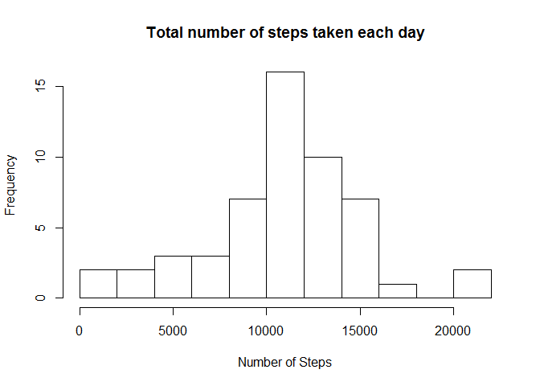
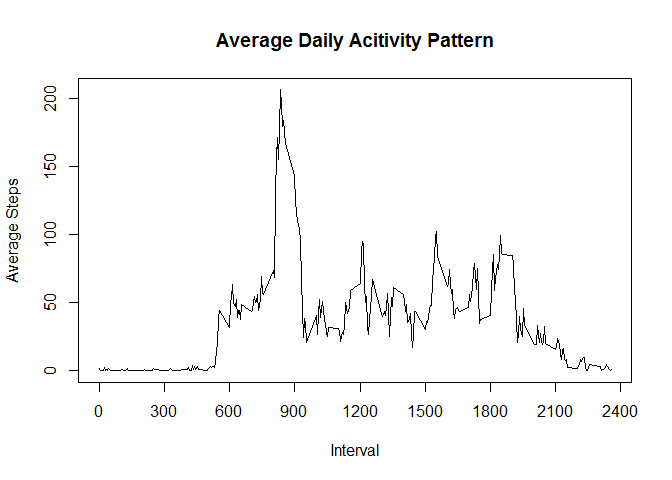
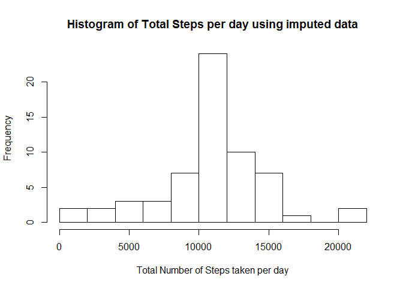
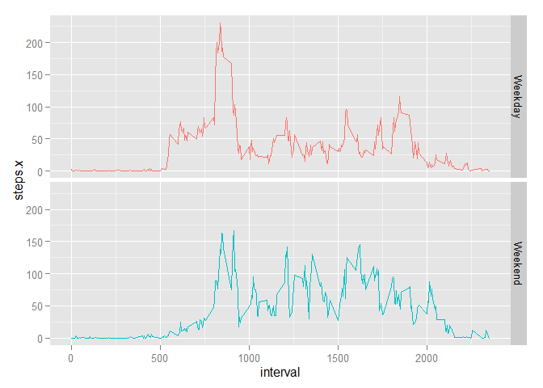

# ReproducibleResearch_PeerAssessment1
Todd Sobiech  
Saturday, December 19, 2015  

This assignment makes use of data from a personal activity monitoring device. This device collects data at 5 minute intervals through out the day. The data consists of two months of data from an anonymous individual collected during the months of October and November, 2012 and include the number of steps taken in 5 minute intervals each day.

The variables included in this dataset are:

    *steps: Number of steps taking in a 5-minute interval (missing values are coded as NA)

    *date: The date on which the measurement was taken in YYYY-MM-DD format

    *interval: Identifier for the 5-minute interval in which measurement was taken


##Loading and preprocessing the data
Load Data

```r
setwd("C:\\Users\\Todd\\Desktop\\TEMPdec2015")
activity = read.csv("12162015_activity.csv", stringsAsFactors = FALSE)
```

Transform Date

```r
activity$date <- as.Date(activity$date,"%m/%d/%Y")
```

Explore the data

```r
dim(activity)
```

```
## [1] 17568     3
```

```r
#View(activity)
head(activity)
```

```
##   steps       date interval
## 1    NA 2012-10-01        0
## 2    NA 2012-10-01        5
## 3    NA 2012-10-01       10
## 4    NA 2012-10-01       15
## 5    NA 2012-10-01       20
## 6    NA 2012-10-01       25
```

```r
str(activity)
```

```
## 'data.frame':	17568 obs. of  3 variables:
##  $ steps   : int  NA NA NA NA NA NA NA NA NA NA ...
##  $ date    : Date, format: "2012-10-01" "2012-10-01" ...
##  $ interval: int  0 5 10 15 20 25 30 35 40 45 ...
```


Explore summary of the data

```r
summary(activity)
```

```
##      steps             date               interval     
##  Min.   :  0.00   Min.   :2012-10-01   Min.   :   0.0  
##  1st Qu.:  0.00   1st Qu.:2012-10-16   1st Qu.: 588.8  
##  Median :  0.00   Median :2012-10-31   Median :1177.5  
##  Mean   : 37.38   Mean   :2012-10-31   Mean   :1177.5  
##  3rd Qu.: 12.00   3rd Qu.:2012-11-15   3rd Qu.:1766.2  
##  Max.   :806.00   Max.   :2012-11-30   Max.   :2355.0  
##  NA's   :2304
```


Reference Packages needed for the analysis


```r
library(dplyr)
```

```
## 
## Attaching package: 'dplyr'
## 
## The following objects are masked from 'package:stats':
## 
##     filter, lag
## 
## The following objects are masked from 'package:base':
## 
##     intersect, setdiff, setequal, union
```

```r
library(ggplot2)
library(lattice)
```

##What are the mean total number of steps taken per day?

Calculate the total number of steps per day


```r
#TotalSteps = tapply(activity$steps,activity$date, sum, na.rm=TRUE, simplify = TRUE)
stepsum <- aggregate(steps ~ date, data = activity, sum)
```

Plot a hisogram of the number of steps taken per day

```r
hist(stepsum$steps,xlab = "Number of Steps", main = "Total number of steps taken each day",breaks = 10)
```

 


Calculate the mean and median total number of steps taken per day.


```r
summary(stepsum$steps)
```

```
##    Min. 1st Qu.  Median    Mean 3rd Qu.    Max. 
##      41    8841   10760   10770   13290   21190
```
The mean number of steps is 10770 and the median is 10760.

##What is the average daily activity pattern?
StepAverage calculates average number of steps taken in 5-minute interval across all days and then plots a time series.


```r
stepmn <- aggregate(steps ~ interval, data = activity, mean)
plot(stepmn$interval
     , stepmn$steps
     , type = "l"
     , main = "Average Daily Acitivity Pattern"
     , xlab = "Interval"
     , ylab = "Average Steps"
     , xaxp = c(0, 2400, 8)
     )
```

 


Which 5-minute interval, on average across all the days in the dataset, contains the maximum number of steps?

```r
stepmn[which.max(stepmn$steps), 1]
```

```
## [1] 835
```
The 5 minute interval with maximum number of steps is 835


#Impute Missing values
Calculate and report the total number of missing values in the dataset (i.e. the total number of rows with NAs)

```r
colSums(is.na(activity))
```

```
##    steps     date interval 
##     2304        0        0
```


Devise a strategy for filling in all of the missing values in the dataset. The strategy does not need to be sophisticated. For example, you could use the mean/median for that day, or the mean for that 5-minute interval, etc.

The missing values were replaced by averages for that 5-minute inverval.

Create a new dataset that is equal to the original dataset but with the missing data filled in.

The activity data and the average of steps data were aggregated. Any missing invternal was replaced with the average steps value.


```r
stepmn2 <- merge(activity, stepmn, by = "interval", all = FALSE) %>% arrange(date, interval)
isna <- which(is.na(stepmn2$steps.x)) # Row number where steps.x is NA
stepmn2[isna, 2] <- stepmn2[isna, 4] # Replace NA with average
stepmn2 <- stepmn2[, c(2, 3, 1)] # Swap and delete columns
```


Review data with the missing data replaced

```r
head(stepmn2)
```

```
##     steps.x       date interval
## 1 1.7169811 2012-10-01        0
## 2 0.3396226 2012-10-01        5
## 3 0.1320755 2012-10-01       10
## 4 0.1509434 2012-10-01       15
## 5 0.0754717 2012-10-01       20
## 6 2.0943396 2012-10-01       25
```


Make a histogram of the total number of steps taken each day and Calculate and report the mean and median total number of steps taken per day.


```r
fsum <- aggregate(steps.x ~ date, data = stepmn2, sum)
hist(fsum$steps.x
     , breaks = 10
     , main = "Histogram of Total Steps per day using imputed data"
     , xlab = "Total Number of Steps taken per day"
     )
```

 
     

Do these values differ from the estimates from the first part of the assignment? What is the impact of imputing missing data on the estimates of the total daily number of steps?


```r
summary(fsum$steps.x)
```

```
##    Min. 1st Qu.  Median    Mean 3rd Qu.    Max. 
##      41    9819   10770   10770   12810   21190
```

```r
summary(stepsum$steps)
```

```
##    Min. 1st Qu.  Median    Mean 3rd Qu.    Max. 
##      41    8841   10760   10770   13290   21190
```


```r
mean(fsum$steps.x) - mean(stepsum$steps)
```

```
## [1] 0
```

```r
median(fsum$steps.x) - median(stepsum$steps)
```

```
## [1] 1.188679
```

The mean values are the same.  The median is slightly higher after addressing missing values.


#Are there differences in activity patterns between weekdays and weekends?

Create a new factor variable in the dataset with two levels - "weekday" and "weekend" indicating whether a given date is a weekday or weekend day.


```r
wdata <- transform(stepmn2, day = weekdays(date))
wdata$day <- ifelse((wdata$day == "Saturday") | (wdata$day == "Sunday"), "Weekend", "Weekday")
```


Make a panel plot containing a time series plot (i.e. type = "l") of the 5-minute interval (x-axis) and the average number of steps taken, averaged across all weekday days or weekend days (y-axis).

Utilized an aggregate function to get averages for weekday and weekend respectively.


```r
weekmn <- aggregate(steps.x ~ interval + day, data = wdata, mean)
head(weekmn)
```

```
##   interval     day    steps.x
## 1        0 Weekday 2.25115304
## 2        5 Weekday 0.44528302
## 3       10 Weekday 0.17316562
## 4       15 Weekday 0.19790356
## 5       20 Weekday 0.09895178
## 6       25 Weekday 1.59035639
```


```r
g <- ggplot(weekmn, aes(x = interval, y = steps.x, group = day))
g <- g + geom_line(aes(colour = day))
g <- g + facet_grid(day ~ .) + theme(legend.position = "none") 
print(g)
```

 

There are visible differences between activities on weekends and weekdays.  There is an increased level of activity demonstrated on the weekends.
